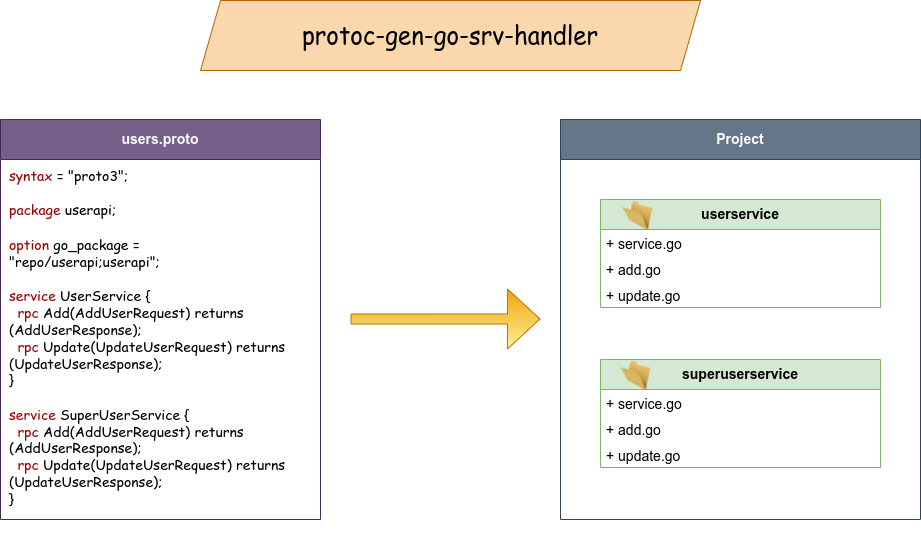

# protoc-gen-go-srv-handler

Protoc plugin for generate go server handlers



## Installation

Run
```shell
go install \
github.com/artarts36/protoc-gen-go-srv-handler \
google.golang.org/protobuf/cmd/protoc-gen-go \
google.golang.org/grpc/cmd/protoc-gen-go-grpc
```

## Usage

Run 
```shell
SERVER_HANDLERS_DIR=./grpc/handlers/
protoc --go_out=. --go_opt=paths=source_relative \
        --go-grpc_out=./ --go-grpc_opt=paths=source_relative \
        --go-srv-handler_out=${SERVER_HANDLERS_DIR} --go-srv-handler_opt=paths=source_relative \
        --go-srv-handler_opt=out_dir=${SERVER_HANDLERS_DIR} \
        --go-srv-handler_opt=overwrite=false \
        --go-srv-handler_opt=pkg_naming=as_is \
        --go-srv-handler_opt=srv_naming=as_is \
        --go-srv-handler_opt=gen_tests=true \
        --go-srv-handler_opt=handler_file_naming=without_domain \
        userapi/*.proto
```
